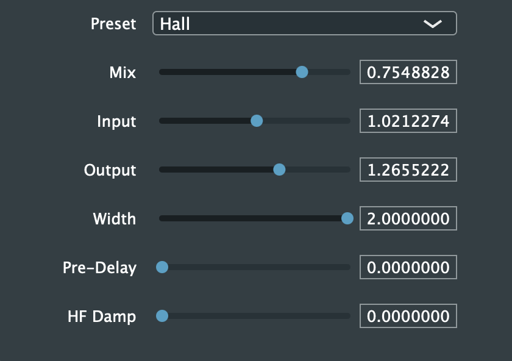

# Ps1Verb

The PlayStation 1 SPU reverb as a VST3/AU plugin, in C++ with JUCE.

Built from nocash's SPU notes,
[reverb formula](https://problemkaputt.de/psxspx-spu-reverb-formula.htm) and
[reverb examples](https://problemkaputt.de/psxspx-spu-reverb-examples.htm),
also mirrored at
[psx-spx](https://psx-spx.consoledev.net/soundprocessingunitspu/).

## Presets

Taken directly from the SPU:

`Room`, `Studio Small`, `Studio Medium`, `Studio Large`, `Hall`,
`Half Echo`, `Space Echo`, `Chaos Echo`, `Delay`

## Demo

Dry, then the same source through `Hall`:

## Build

Needs [JUCE](https://github.com/juce-framework/JUCE). The `.jucer` uses
Projucer's global module path, so either clone JUCE to `~/JUCE` or set
**Projucer -> Settings -> Global Paths -> JUCE Modules** to the install location.

Open `Ps1Verb.jucer` in Projucer, save to generate the build files, then build.
